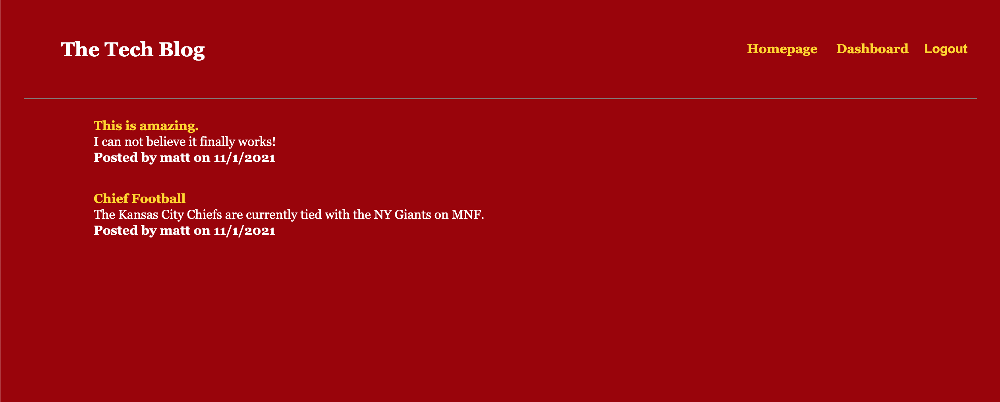

# Tech Blog

The goal of this app is to provide the user with a CMS-style blog site, similar to Wordpress, where users can publish their blog posts and comment on ther posts from other users as well. This app follows the MVC paradigm in structure and utilizes Handlebars.js as the templating language, Sequelize as the ORM, and express-session for authentication. Users are required to create an account to have the ability to interact on posts.

## Getting Started

The user will need to clone the repository from GitHub and run the command `npm install` on their command line, after install user will need to run `source db/schema.sql` to build the database and `npm start` to turn the server.

## Deployed Link

* [See Live Site](https://stormy-crag-17205.herokuapp.com/)

## Authors

* **Matt Weichel** 

- [Link to Github](https://github.com/maweiche)

## License

This project is licensed under the MIT License 

## Acknowledgments

* Hat tip to anyone whose code, libraries, packages, or UI was used  / inspired from
